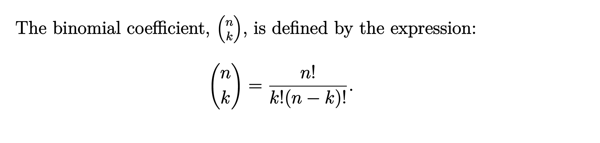
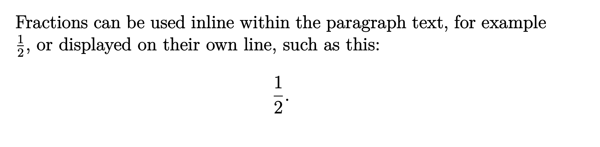
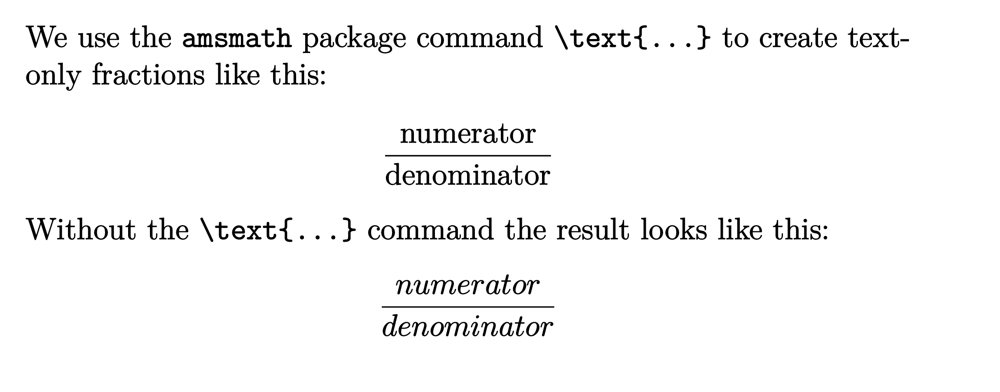
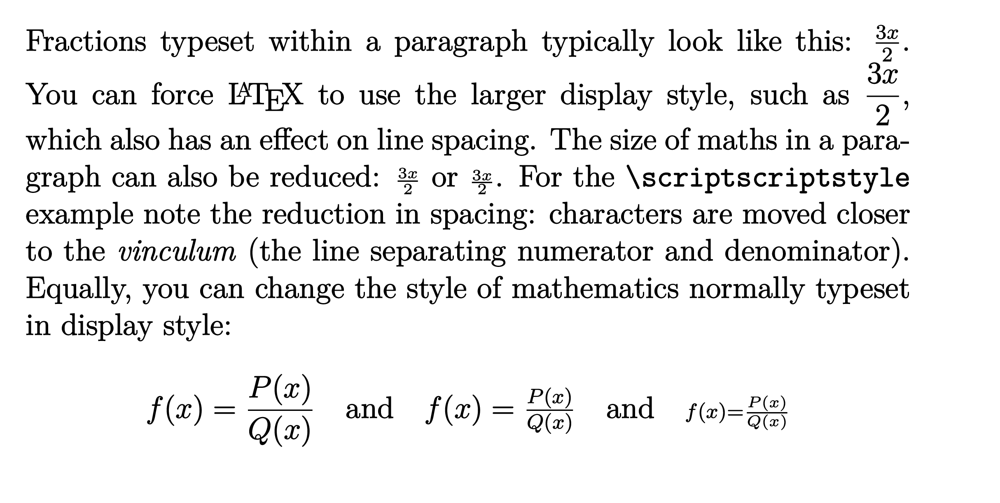
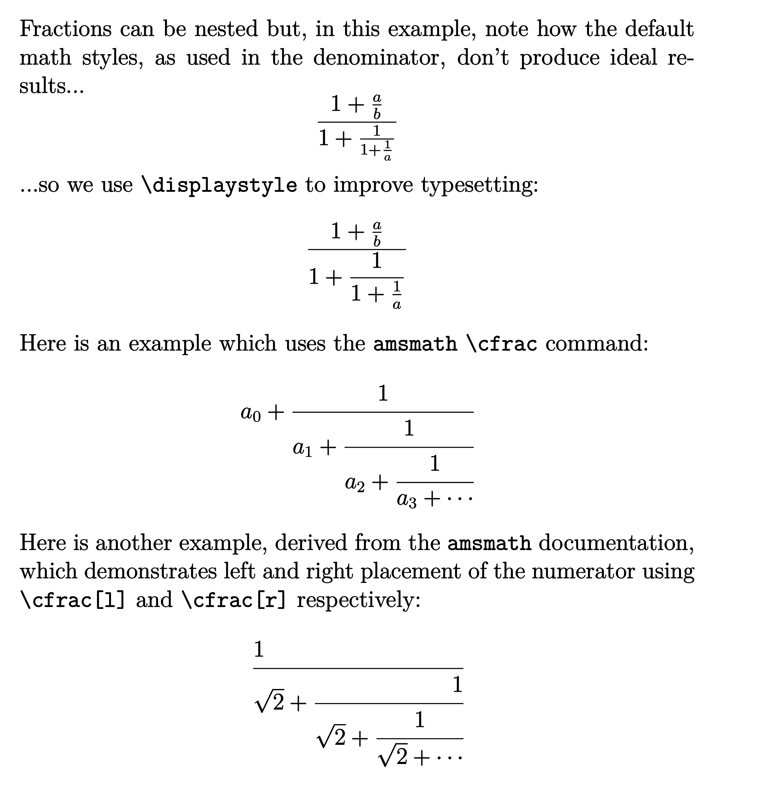

# Math Symbols

## Fractions and Binomials

### Binomials

This section explains how to typeset fractions and binomial coefficients, starting with the following example which uses the [amsmath package](https://ctan.org/pkg/amsmath?lang=en):

```latex
\documentclass{article}

\usepackage{amsmath}

\begin{document}

The binomial coefficient, \(\binom{n}{k}\), is defined by the expression:
\[ \binom{n}{k} = \frac{n!}{k!(n-k)!}. \]

\end{document}
```

The [amsmath package](https://ctan.org/pkg/amsmath?lang=en) is loaded by adding the following line to the document preamble:

```latex
\usepackage{amsmath}
```

Here is the output produced:

.

#### Displaying fractions

The visual appearance of fractions will change depending on whether they appear inline, as part of a paragraph, or typeset as standalone material displayed on their own line. The next example demonstrates those changes to visual appearance:

```latex
\documentclass{article}

\begin{document}

Fractions can be used inline within the paragraph text, for example \(\frac{1}{2}\), or displayed on their own line, such as this:
\[ \frac{1}{2}. \]

\end{document}
```

This example produces the following output:

.

> **Note:** More information on inline and display versions of mathematics can be found in the Overleaf article [Display style in math mode](https://www.overleaf.com/learn/latex/Display_style_in_math_mode). Our example fraction is typeset using the `\frac` command (`\frac{1}{2}`) which has the general form `\frac{numerator}{denominator}`.

### Text in Mathematics

The following example demonstrates typesetting text-only fractions by using the `\text{...}` command provided by the amsmath package. The `\text{...}` command is used to prevent LaTeX typesetting the text as regular mathematical content.

```latex
\documentclass{article}

\usepackage{amsmath} % For the \text{...} command

\begin{document}

We use the \texttt{amsmath} package command \verb|\text{...}| to create text-only fractions like this:
\[\frac{\text{numerator}}{\text{denominator}}\]
Without the \verb|\text{...}| command the result looks like this:
\[\frac{numerator}{denominator}\]

\end{document}
```

This example produces the following output:

.

#### Size and spacing within typeset mathematics

The size and spacing of mathematical material typeset by LaTeX is [determined by algorithms](https://tug.org/TUGboat/tb27-1/tb86jackowski.pdf) which apply size and positioning data contained inside the fonts used to typeset mathematics. Occasionally, it may be necessary, or desirable, to override the default mathematical styles—size and spacing of math elements—chosen by LaTeX, a topic discussed in the Overleaf help article [Display style in math mode](https://www.overleaf.com/learn/latex/Display_style_in_math_mode#Overriding_default_mathematical_styles).

To summarize, the default style(s) used to typeset mathematics can be changed by the following commands:

- `\textstyle`: apply the style used for mathematics typeset in paragraphs;
- `\displaystyle`: apply the style used for mathematics typeset on lines by themselves;
- `\scriptstyle`: apply the style used for subscripts or superscripts;
- `\scriptscriptstyle`: apply the style used for second-order subscripts or superscripts;

which are demonstrated in the next example.

```latex
\documentclass{article}

\begin{document}

Fractions typeset within a paragraph typically look like this: \(\frac{3x}{2}\).
You can force \LaTeX{} to use the larger display style, such as \( \displaystyle \frac{3x}{2} \), which also has an effect on line spacing.
The size of maths in a paragraph can also be reduced: \(\scriptstyle \frac{3x}{2}\) or \(\scriptscriptstyle \frac{3x}{2}\).
For the \verb|\scriptscriptstyle| example note the reduction in spacing: characters are moved closer to the \textit{vinculum} (the line separating numerator and denominator).
Equally, you can change the style of mathematics normally typeset in display style:
\[f(x)=\frac{P(x)}{Q(x)}\quad \textrm{and}\quad \textstyle f(x)=\frac{P(x)}{Q(x)}\quad \textrm{and}\quad \scriptstyle f(x)=\frac{P(x)}{Q(x)}\]

\end{document}
```

This example produces the following output:

.

#### Continued fractions

Fractions can be nested to obtain more complex expressions. The second pair of fractions displayed in the following example both use the `\cfrac` command, designed specifically to produce continued fractions. To use `\cfrac` you must load the [amsmath package](https://ctan.org/pkg/amsmath?lang=en) in the document preamble.

```latex
\documentclass{article}

% Load amsmath to access the \cfrac{...}{...} command
\usepackage{amsmath}

\begin{document}

Fractions can be nested but, in this example, note how the default math styles, as used in the denominator, don't produce ideal results...
\[ \frac{1+\frac{a}{b}}{1+\frac{1}{1+\frac{1}{a}}} \]
\noindent ...so we use \verb|\displaystyle| to improve typesetting:
\[ \frac{1+\frac{a}{b}}{\displaystyle 1+\frac{1}{1+\frac{1}{a}}} \]
Here is an example which uses the \texttt{amsmath} \verb|\cfrac| command:
\[ a_0+\cfrac{1}{a_1+\cfrac{1}{a_2+\cfrac{1}{a_3+\cdots}}} \]
Here is another example, derived from the \texttt{amsmath} documentation, which demonstrates left and right placement of the numerator using \verb|\cfrac[l]| and \verb|\cfrac[r]| respectively:
\[ \cfrac[l]{1}{\sqrt{2}+ \cfrac[r]{1}{\sqrt{2}+ \cfrac{1}{\sqrt{2}+\dotsb}}} \]

\end{document}
```

This example produces the following output:

.

### Matrices

#### amsmath matrix environments

The `amsmath` package provides commands to typeset matrices with different delimiters. Once you have loaded `\usepackage{amsmath}` in your preamble, you can use the following environments in your math environments:

| Type | LaTeX markup | Renders as |
| --- | --- | --- |
| Plain | `\begin{matrix} 1 & 2 & 3\\ a & b & c \end{matrix}` | $\begin{matrix} 1 & 2 & 3\\ a & b & c \end{matrix}$ |
| Parentheses; round brackets | `\begin{pmatrix} 1 & 2 & 3\\ a & b & c \end{pmatrix}` | $\begin{pmatrix} 1 & 2 & 3\cr a & b & c \end{pmatrix}$ |
| Brackets; square brackets | `\begin{bmatrix} 1 & 2 & 3\\ a & b & c \end{bmatrix}` | $\begin{bmatrix} 1 & 2 & 3\cr a & b & c \end{bmatrix}$ |
| Braces; curly brackets | `\begin{Bmatrix} 1 & 2 & 3\\ a & b & c \end{Bmatrix}` | $\begin{Bmatrix} 1 & 2 & 3\cr a & b & c \end{Bmatrix}$ |
| Pipes | `\begin{vmatrix} 1 & 2 & 3\\ a & b & c \end{vmatrix}` | $\begin{vmatrix} 1 & 2 & 3\cr a & b & c \end{vmatrix}$ |
| Double pipes | `\begin{Vmatrix} 1 & 2 & 3\\ a & b & c \end{Vmatrix}` | $\begin{Vmatrix} 1 & 2 & 3\cr a & b & c \end{Vmatrix}$ |

If you need to create matrices with different [delimiters](https://www.overleaf.com/learn/latex/Brackets_and_Parentheses), you can add them manually to a plain `matrix`. For example:

| LaTeX markup | Renders as |
| --- | --- |
| `\left\lceil \begin{matrix} 1 & 2 & 3\\ a & b & c \end{matrix} \right\rceil` | $\left\lceil \begin{matrix} 1 & 2 & 3\cr a & b & c \end{matrix} \right\rceil$ |
| `\left\langle \begin{matrix} 1 & 2 & 3\\ a & b & c \end{matrix} \right\rvert` | $\left\langle \begin{matrix} 1 & 2 & 3\cr a & b & c \end{matrix} \right\rvert$ |
| `\left\langle \begin{matrix} 1 & 2 & 3\\ a & b & c \end{matrix} \right\rangle` | $\left\langle \begin{matrix} 1 & 2 & 3\cr a & b & c \end{matrix} \right\rangle$ |

#### Inline matrices

When typesetting inline math, the usual `matrix` environments above may look too big. It may be better to use `smallmatrix` in such situations, although you will need to provide your own [delimiters](https://www.overleaf.com/learn/latex/Brackets_and_Parentheses).

```latex
\documentclass{article}

\usepackage{amsmath}

\begin{document}

Trying to typeset an inline matrix here: $\begin{pmatrix} a & b\\ c & d \end{pmatrix}$, but it looks too big, so let's try $\big(\begin{smallmatrix} a & b\\ c & d \end{smallmatrix}\big)$ instead.

\end{document}
```

The following image shows the output produced by the example above:

.

The `mathtools` package provides `psmallmatrix`, `bsmallmatrix` etc environments for convenience.

- - -

Next: **[Inserting Figures](latexfigures.md)**
